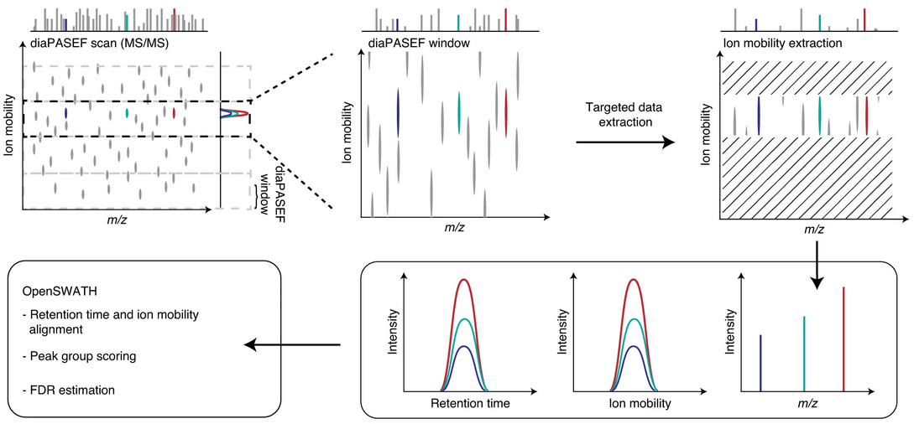

Mobi-DIK
========

Overview
--------

Mobi-DIK (Ion Mobility DIA Tool-Kit) is a workflow for the analysis of DIA data
coupled with ion mobility (**diaPASEF**) [3]_. Mobi-DIK is an extension of the OpenSWATH workflow [1]_
that is optimized for ion mobility analysis as well as diapysef [2]_, a Python
package for converting diaPASEF data from vendor format to open mzML format.

   Mobi-DIK workflow for targeted data extraction from diaPASEF data. Image adapted from figure 3 from Meir. et al. (2020) [3]_.

Contact and Support
-------------------

We provide support for Mobi-DIK on `OpenMS github issue tracker
<https://github.com/OpenMS/OpenMS/issues>`_, `diapysef github issue tracker
<https://github.com/Roestlab/dia-pasef/issues>`_
and other available `OpenMS discord server <https://discord.gg/4TAGhqJ7s5>`_. 

Installation
------------

Mobi-DIK is fully integrated within the tools of the OpenSWATH workflow. Please
follow the `installation instructions <binaries.html>`_ for the latest
development branches. 

Tutorial
--------

Conversion
~~~~~~~~~~

Taking the raw tdf files in sqlite format, ``diapysef`` can convert the raw
files to standard format mzML. :doc:`dataconversion` shows the functionalities
of the data conversion in details. Different comands can be used for data
conversion:

.. code-block:: bash
   
   diapysef converttdftomzml --help
   diapysef converttdftomzml --in=input.d --out=output.mzML

Library Generation
~~~~~~~~~~~~~~~~~~

Library generation can be performed similar to traditional DIA data, see :doc:`../generic` and :doc:`../pqp`. See :doc:`../fragpipe` for a FragPipe-based spectral library generation workflow.

For the legacy library generation workflow using MaxQuant output and diapysef, please follow instructions at :doc:`librarygeneration`.

Calibration Libraries
----

For retention time and ion mobility calibration, please follow instructions at :doc:`../calibration/generic` and :doc:`../calibration/run_specific`.

For calibration libraries used in the original publication [3]_, please find below:

- iRT files from HeLa cell lysate can be obtained here: `linear iRT files <https://drive.google.com/open?id=1S53bh_ge2CmX73p5oqtwxMI1E17hklm7>`_.
- iRT files from HeLa cell lysate can be obtained here: `nonlinear iRT file <https://drive.google.com/open?id=1WKL7j4D1tYKLBUdrXbj3ObUfUyNb2CvS>`_.

Identification and quantification
~~~~~~~~~~~~~~~~~~~~~~~~~~~~~~

For targeted data extraction, please follow instructions at :doc:`../openswathworkflow` and see the :doc:`openswath_mobidik` section for ion mobility specific parameters.

For statistical scoring and FDR estimation, please follow instructions at :doc:`../pyprophet`.

Other Functionalities
~~~~~~~~~~~~~~~~~~~~~

The data acquisition window schemes can be acquired with ``get_dia_windows.py`` from the `diapysef repo <https://github.com/Roestlab/dia-pasef/blob/master/src/diapysef/scripts/get_dia_windows.py>`_:

.. code-block:: bash

   get_dia_windows.py pasef_data_dir.d/ output_scheme.csv

A csv file can be written with the m/z isolation windows, collision energies, and the ion mobility isolation windows etc.

Output of the scheme can also be plotted over the MaxQuant outputs in the mz and im dimensions:

.. code-block:: bash
   
   plot_dia_windows.py output_scheme.csv MQ_output_all_peptides.csv

References
----------

.. [1] Röst HL, Rosenberger G, Navarro P, Gillet L, Miladinović SM, Schubert OT, Wolski W, Collins BC, Malmström J, Malmström L, Aebersold R. OpenSWATH enables automated, targeted analysis of data-independent acquisition MS data. Nat Biotechnol. 2014 Mar 10;32(3):219-23. doi: 10.1038/nbt.2841. PMID: 24727770
.. [2] see https://github.com/Roestlab/dia-pasef/
.. [3] Florian Meier, Andreas-David Brunner, Max Frank, Annie Ha, Eugenia Voytik, Stephanie Kaspar-Schoenefeld, Markus Lubeck, Oliver Raether, Ruedi Aebersold, Ben C. Collins, Hannes L. Röst, Matthias Mann. diaPASEF: parallel accumulation–serial fragmentation combined with data-independent acquisition. Nature Methods volume 17, pages 1229–1236 (2020). doi: https://www.nature.com/articles/s41592-020-00998-0

