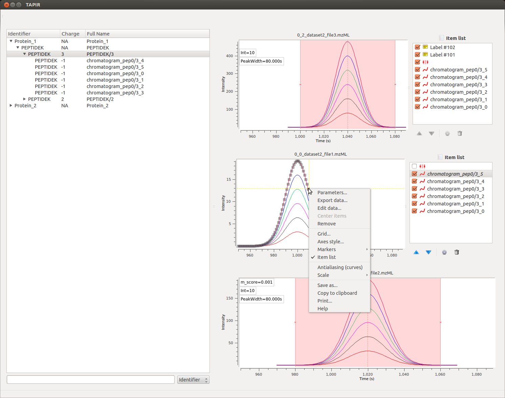

TAPIR
=========

Overview
--------

TAPIR [1]_ is a visualization software for chromatographic data obtained by mass spectrometry. It provides efficient visualization of high-throughput targeted proteomics experiments.

The TAPIR software is a fast and efficient Python visualization software for chromatograms and peaks identified in targeted proteomics experiments. The input formats are open, community-driven standardized data formats (mzML for raw data storage and TraML encoding the hierarchical relationships between transitions, peptides and proteins).

TAPIR is scalable to proteome-wide targeted proteomics studies (as enabled by SWATH-MS), allowing researchers to visualize high-throughput datasets. The framework integrates well with existing automated analysis pipelines and can be extended beyond targeted proteomics to other types of analyses.

Contact and Support
-------------------

We provide support for TAPIR on the `GitHub repository
<https://github.com/msproteomicstools/msproteomicstools/issues>`_.

You can contact the author `Hannes Röst
<http://www.hroest.ch>`_.

Installation
------------

You can download binaries for `Mac
<http://proteomics.ethz.ch/tapir/TAPIR_1.0_MAC.zip>`_ and `Microsoft Windows (64 bit)
<http://proteomics.ethz.ch/tapir/TAPIR_1.0_WIN.zip>`_ directly from this website. The source code is available from `Github
<https://github.com/msproteomicstools/msproteomicstools>`_ which allows source-based installation. Please follow the instructions found there for manual installation or installation on a Linux system.

Note: for a successfull installation on Mac OS X, extract the provided file and drag it into the ``Applications`` folder. You may need to allow execution of the software if you see a warning that TAPIR is from an "unidentified developer". Simply go to System Preferences, click on "Security & Privacy" and in the "General" tab allow the execution of TAPIR.

Tutorial
--------

The TAPIR software is highly flexible and interactive, allowing for investigation of single data traces and data points. Each graph item can be selected and inspected individually, allowing for customization of the visualization and production of publication-quality figures. Data can be exported as an image or in table format and used for further analysis; individual traces can be removed or re-added and all graph settings (such as color, line width, line style etc.) are fully customizable. The implementation relies on guiqwt for these features.

Data
----

Availability
~~~~~~~~~~~~

You can `download
<http://proteomics.ethz.ch/tapir/sample_data_small.zip>`_ a small sample dataset. A larger, real-life dataset can be obtained by downloading these five files (this might take a while since the whole dataset is ca 5 GB)

`Dataset 1 (Cond 1)
<http://proteomics.ethz.ch/tapir/hroest_K120808_Strep0PlasmaBiolRepl1_R02_SW.chrom.mzML>`_

`Dataset 2 (Cond 1)
<http://proteomics.ethz.ch/tapir/hroest_K120808_Strep0PlasmaBiolRepl2_R02_SW.chrom.mzML>`_

`Dataset 3 (Cond 2)
<http://proteomics.ethz.ch/tapir/hroest_K120808_Strep10PlasmaBiolRepl1_R02_SW.chrom.mzML>`_

`Dataset 4 (Cond 2)
<http://proteomics.ethz.ch/tapir/hroest_K120808_Strep10PlasmaBiolRepl2_R02_SW.chrom.mzML>`_

`Peak description file
<http://proteomics.ethz.ch/tapir/picked_peaks.csv>`_

This dataset is retrieved from the original OpenSWATH publication [2]_ and the two conditions (0% and 10%) refer to the treatment of *S. pyogenes* with human plasma. For each condition, two biological replicates are available.

References
----------
.. [1] Röst HL, Rosenberger G, Aebersold R, Malmström L. Efficient visualization of high-throughput targeted proteomics experiments: TAPIR. Bioinformatics. 2015 Jul 15;31(14):2415-7. doi: 10.1093/bioinformatics/btv152. Epub 2015 Mar 18. PMID: 25788625

.. [2] Röst HL, Rosenberger G, Navarro P, Gillet L, Miladinović SM, Schubert OT, Wolski W, Collins BC, Malmström J, Malmström L, Aebersold R. OpenSWATH enables automated, targeted analysis of data-independent acquisition MS data. Nat Biotechnol. 2014 Mar 10;32(3):219-23. doi: 10.1038/nbt.2841. PMID: 24727770

