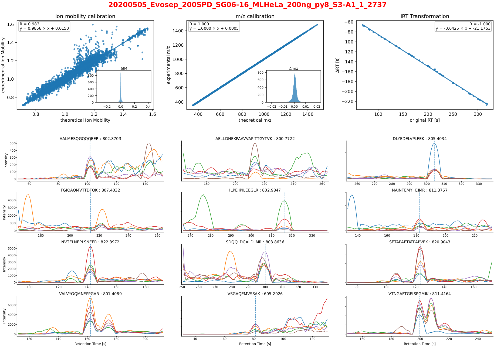

Analysis of diaPASEF Data
=========================

For this tutorial, we are using publicly available data from the publication:  
`*Meier et al., Nature Methods (2020)* <https://www.nature.com/articles/s41592-020-00998-0#Sec10>`_. 

We will perform the following steps in this tutorial:

1. Spectral library generation using
   
   * Generating pseudo-spectra using diaTracer
   * Search pseudo-spectra using MSFragger
   * Validate PSMs using PeptideProphet and iProphet
   * Generate Spectral Library using EasyPQP
   * Generate Run-Specific iRT libraries

2. Targeted Data Extraction using OpenSwathWorkflow
3. Statistical Scoring and FDR Control using PyProphet

Data
----

The dataset is deposited in PRIDE under accession `PXD017703 <https://www.ebi.ac.uk/pride/archive/projects/PXD017703>`_.  
Specifically, we will work with the **HeLa_Evosep_diaPASEF_RAW.zip** experiment, focusing on the `200SPD_py8` experiment.

You should see the following files when you download and unzip the data (assuming you are in the ``HeLa_Evosep_diaPASEF_RAW/200SPD_py8`` directory):

.. code-block:: bash

    20200505_Evosep_200SPD_SG06-16_MLHeLa_200ng_py8_S3-A4_1_2740.d
    20200505_Evosep_200SPD_SG06-16_MLHeLa_200ng_py8_S3-A1_1_2737.d
    20200505_Evosep_200SPD_SG06-16_MLHeLa_200ng_py8_S3-A2_1_2738.d

Software requirements
---------------------

To follow along, you will need the following software installed:

- **Java** (≥ v1.8) for running diaTracer and MSFragger
  
  - **diaTracer** (≥ v1.3.3) for generating pseudo-spectra from diaPASEF data
  - **msfragger** (≥ v4.3) for proteomics database searching
  
- **TPP** (≥ v7.2.0) for PSM validation using PeptideProphet and iProphet
- **OpenMS** (≥ v3.4) for various data processing steps including spectral library generation and running OpenSwathWorkflow
- **Python** (≥ 3.10) with the following packages:

  - `easypqp (≥ v0.1.53)` (for spectral library generation)
  - `diapysef (≥ v1.0.10)` (for Bruker tdf file conversion)
  - `pyprophet (≥ v3.0.2)` (for statistical scoring and FDR control)
  
- **Docker** (optional) if you prefer running the tools in a containerized environment  

Make sure these tools are available in your PATH before proceeding.

Spectral Library Generation
---------------------------

To analyze diaPASEF data with OpenSwath, a spectral library is required. This can be generated using any of the tools mentioned in the `Spectral library generation <../spectral_library_generation.html>`_ section. For this tutorial, we will use a spectral library generated using pseudo-spectra generated from diaTracer and using MSFragger for spectra database searching.

.. note::

    If you prefer a GUI, you can also use `FragPipe <https://fragpipe.nesvilab.org/>`_ to generate the spectral library. FragPipe provides an integrated environment for running diaTracer, MSFragger, PeptideProphet/Percolator, iProphet, and EasyPQP. See the :doc:`fragpipe` section.

.. note::

    In this tutorial, we are only using diaPASEF data. However, if you have ddaPASEF data as well, you can create a consensus library using both ddaPASEF and the pseudo-spectra from diaPASEF. 

Generating pseudo-spectra using diaTracer
~~~~~~~~~~~~~~~~~~~~~~~~~~~~~~~~

.. code-block:: bash

    #!/bin/bash

    mkdir -p library/
    mkdir -p library/diatracer/

    # Run diaTracer on all .d directories using all available CPU cores
    find . -maxdepth 1 -name "*.d" -type d | parallel -j+0 \
        'input_file={}; \
        base_name=$(basename "$input_file"); \
        log_file="library/diatracer/diatracer_${base_name}.log"; \
        echo "Processing $base_name - Output going to $log_file"; \
        java -jar /diaTracer.jar --dFilePath "$base_name" --workDir "library/diatracer/" --deltaApexIM 0.01 --deltaApexRT 3 --ms1MS2Corr 0.3 --massDefectFilter 0 --massDefectOffset 0.1 --RFMax 500 --threadNum 3 > "$log_file" 2>&1'

.. note::

   The above command uses GNU Parallel to process all .d directories in the current directory, generating pseudo-spectra for each and saving the logs to individual files. To control the number of concurrent jobs, adjust the `-j` parameter in the `parallel` command, for example, `-j4` to limit to 4 simultaneous jobs.

Search pseudo-spectra using MSFragger
~~~~~~~~~~~~~~~~~~~~~~~~~~~~~~

You can retrieve a suitable fasta file from the `UniProt website <https://www.uniprot.org/proteomes/UP000005640>`_ (Human reference proteome). Make sure to include common contaminants and reverse decoys in the fasta file. For the following tutorial, we use the following `fasta file <https://github.com/OpenSWATH/workflows/blob/master/data_library/library.fasta>`_.
If your fasta file does not contain decoys, you can generate and append a decoy database using OpenMS's DecoyDatabase tool.

.. code-block:: bash
    docker run --rm -v $PWD:/data/ ghcr.io/openms/openms-executables  \ DecoyDatabase -in /data/library.fasta -out /data/library_decoys.fasta

.. code-block:: bash

    #!/bin/bash

    mkdir -p library/msfragger/
    wdir=$(pwd)
    # Copy the fasta file to the msfragger directory since our param file points to the current relative path, which will be the msfragger directory when we run MSFragger
    cp library_decoys.fasta library/msfragger/
    cd library/msfragger/

    # Run MSFragger on all pseudo-spectra mzML files using 1 job at a time
    ls -1 $wdir/library/diatracer/*_diatracer.mzML | parallel -j1 \
        'input_file={}; \
        base_name=$(basename "$input_file" .mzML); \
        log_file="library/msfragger/msfragger_${base_name}.log"; \
        echo "Processing $base_name - Output going to $log_file"; \
        java -Xmx16G -jar /MSFragger.jar $wdir/fragger_closed.params $wdir/"$base_name".mzML > "$log_file" 2>&1'

    cd $wdir

.. collapse:: fragger_closed.params

    .. code-block:: bash

        num_threads = 4                             # Number of CPU threads to use. 
        database_name = library_decoys.fasta                  # Path to the protein database file in FASTA format.

        precursor_mass_lower = -20			# Lower bound of the precursor mass window.
        precursor_mass_upper = 20			# Upper bound of the precursor mass window.
        precursor_mass_units = 1			# Precursor mass tolerance units (0 for Da, 1 for ppm).
        data_type = 0			# Data type (0 for DDA, 1 for DIA, 2 for gas-phase fractionation DIA, 3 for DDA+).
        precursor_true_tolerance = 20			# True precursor mass tolerance (window is +/- this value).
        precursor_true_units = 1			# True precursor mass tolerance units (0 for Da, 1 for ppm).
        fragment_mass_tolerance = 20			# Fragment mass tolerance (window is +/- this value).
        fragment_mass_units = 1			# Fragment mass tolerance units (0 for Da, 1 for ppm).
        calibrate_mass = 2			# Perform mass calibration (0 for OFF, 1 for ON, 2 for ON and find optimal parameters, 4 for ON and find the optimal fragment mass tolerance).
        use_all_mods_in_first_search = 0			# Use all variable modifications in first search (0 for No, 1 for Yes).
        decoy_prefix = DECOY_                         # Prefix added to the decoy protein ID.

        deisotope = 1			# Perform deisotoping or not (0=no, 1=yes and assume singleton peaks single charged, 2=yes and assume singleton peaks single or double charged).
        deneutralloss = 1			# Perform deneutrallossing or not (0=no, 1=yes).
        isotope_error = 0/1/2/3			# Also search for MS/MS events triggered on specified isotopic peaks.
        mass_offsets = 0.0			# Creates multiple precursor tolerance windows with specified mass offsets.
        mass_offsets_detailed = 			# Optional detailed mass offset list. Overrides mass_offsets if use_detailed_offsets = 1.
        use_detailed_offsets = 0			# Whether to use the regular (0) or detailed (1) mass offset list.
        precursor_mass_mode = selected			# One of isolated/selected/corrected.

        remove_precursor_peak = 1			#  Remove precursor peaks from tandem mass spectra. 0 = not remove; 1 = remove the peak with precursor charge; 2 = remove the peaks with all charge states (only for DDA mode).
        remove_precursor_range = -1.500000,1.500000			# m/z range in removing precursor peaks. Only for DDA mode. Unit: Th.
        intensity_transform = 0			# Transform peaks intensities with sqrt root. 0 = not transform; 1 = transform using sqrt root.
        activation_types = all			# Filter to only search scans of provided activation type(s), separated by /. Allowed: All, HCD, CID, ETD, ECD.
        analyzer_types = all       # Filter to only include scans matching the provided analyzer type(s) in search, separated by /. Only support the mzML and raw format. Allowed types: all, FTMS, ITMS.
        group_variable = 0			# Specify the variable used to decide the PSM group in the group FDR estimation. 0 = no group FDR; 1 = num_enzyme_termini; 2 = PE from protein header.
        require_precursor = 1			# If required, PSMs with no precursor peaks will be discarded. For DIA data type only. 0 = no, 1 = yes.
        reuse_dia_fragment_peaks = 0			# Allow the same peak matches to multiple peptides. For DIA data type only. 0 = no, 1 = yes.

        write_calibrated_mzml = 1			# Write calibrated MS2 scan to a mzML file (0 for No, 1 for Yes).
        write_uncalibrated_mzml = 0			# Write uncalibrated MS2 scan to a MGF file (0 for No, 1 for Yes). Only for .raw and .d formats.
        write_mzbin_all = 0
        mass_diff_to_variable_mod = 0			# Put mass diff as a variable modification. 0 for no; 1 for yes and remove delta mass; 2 for yes and keep delta mass.

        localize_delta_mass = 0			# Include fragment ions mass-shifted by unknown modifications (recommended for open and mass offset searches) (0 for OFF, 1 for ON).
        delta_mass_exclude_ranges = (-1.5,3.5)			# Exclude mass range for shifted ions searching.
        fragment_ion_series = b,y			# Ion series used in search, specify any of a,b,c,x,y,z,Y,b-18,y-18 (comma separated).
        ion_series_definitions = 			# User defined ion series. Example: "b* N -17.026548;b0 N -18.010565".

        labile_search_mode = off			# type of search (nglycan, labile, or off). Off means non-labile/typical search.
        restrict_deltamass_to = all			# Specify amino acids on which delta masses (mass offsets or search modifications) can occur. Allowed values are single letter codes (e.g. ACD) and '-', must be capitalized. Use 'all' to allow any amino acid.
        diagnostic_intensity_filter = 0			# [nglycan/labile search_mode only]. Minimum relative intensity for SUM of all detected oxonium ions to achieve for spectrum to contain diagnostic fragment evidence. Calculated relative to spectrum base peak. 0 <= value.
        Y_type_masses = 			#  [nglycan/labile search_mode only]. Specify fragments of labile mods that are commonly retained on intact peptides (e.g. Y ions for glycans). Only used if 'Y' is included in fragment_ion_series.
        diagnostic_fragments = 			# [nglycan/labile search_mode only]. Specify diagnostic fragments of labile mods that appear in the low m/z region. Only used if diagnostic_intensity_filter > 0.
        remainder_fragment_masses = 			# [labile search_mode only] List of possible remainder fragment ions to consider. Remainder masses are partial modification masses left on b/y ions after fragmentation.

        search_enzyme_name_1 = stricttrypsin			# Name of the first enzyme.
        search_enzyme_cut_1 = KR			# First enzyme's cutting amino acid.
        search_enzyme_nocut_1 = 			# First enzyme's protecting amino acid.
        search_enzyme_sense_1 = C			# First enzyme's cutting terminal.
        allowed_missed_cleavage_1 = 2			# First enzyme's allowed number of missed cleavages per peptide. Maximum value is 5.

        search_enzyme_name_2 = null			# Name of the second enzyme.
        search_enzyme_cut_2 = 			# Second enzyme's cutting amino acid.
        search_enzyme_nocut_2 = 			# Second enzyme's protecting amino acid.
        search_enzyme_sense_2 = C			# Second enzyme's cutting terminal.
        allowed_missed_cleavage_2 = 2			# Second enzyme's allowed number of missed cleavages per peptide. Maximum value is 5.

        num_enzyme_termini = 2			# 0 for non-enzymatic, 1 for semi-enzymatic, and 2 for fully-enzymatic.

        clip_nTerm_M = 1			# Specifies the trimming of a protein N-terminal methionine as a variable modification (0 or 1).

        # maximum of 16 mods - amino acid codes, * for any amino acid, [ and ] specifies protein termini, n and c specifies peptide termini
        variable_mod_01 = 15.9949 M 3
        variable_mod_02 = 42.0106 [^ 1
        # variable_mod_03 = 79.96633 STY 3
        # variable_mod_04 = -17.0265 nQnC 1
        # variable_mod_05 = -18.0106 nE 1
        # variable_mod_06 = 4.025107 K 2
        # variable_mod_07 = 6.020129 R 2
        # variable_mod_08 = 8.014199 K 2
        # variable_mod_09 = 10.008269 R 2
        # variable_mod_10 = 0.0 site_10 1
        # variable_mod_11 = 0.0 site_11 1
        # variable_mod_12 = 0.0 site_12 1
        # variable_mod_13 = 0.0 site_13 1
        # variable_mod_14 = 0.0 site_14 1
        # variable_mod_15 = 0.0 site_15 1
        # variable_mod_16 = 0.0 site_16 1

        allow_multiple_variable_mods_on_residue = 0
        max_variable_mods_per_peptide = 3			# Maximum total number of variable modifications per peptide.
        max_variable_mods_combinations = 5000			# Maximum number of modified forms allowed for each peptide (up to 65534).

        output_format = pepXML_pin			# File format of output files (tsv, pin, pepxml, tsv_pin, tsv_pepxml, pepxml_pin, or tsv_pepxml_pin).
        output_report_topN = 1			# Reports top N PSMs per input spectrum.
        output_max_expect = 50			# Suppresses reporting of PSM if top hit has expectation value greater than this threshold.
        report_alternative_proteins = 1			# Report alternative proteins for peptides that are found in multiple proteins (0 for no, 1 for yes).

        precursor_charge = 1 4			# Assumed range of potential precursor charge states. Only relevant when override_charge is set to 1.
        override_charge = 0			# Ignores precursor charge and uses charge state specified in precursor_charge range (0 or 1).

        digest_min_length = 7			# Minimum length of peptides to be generated during in-silico digestion.
        digest_max_length = 50			# Maximum length of peptides to be generated during in-silico digestion.
        digest_mass_range = 500.0 5000.0			# Mass range of peptides to be generated during in-silico digestion in Daltons.
        max_fragment_charge = 2			# Maximum charge state for theoretical fragments to match (1-4).

        track_zero_topN = 0			# Track top N unmodified peptide results separately from main results internally for boosting features.
        zero_bin_accept_expect = 0			# Ranks a zero-bin hit above all non-zero-bin hit if it has expectation less than this value.
        zero_bin_mult_expect = 1			# Multiplies expect value of PSMs in the zero-bin during  results ordering (set to less than 1 for boosting).

        check_spectral_files = 1			# Checking spectral files before searching.
        minimum_peaks = 15			# Minimum number of peaks in experimental spectrum for matching.
        use_topN_peaks = 150			# Pre-process experimental spectrum to only use top N peaks.
        min_fragments_modelling = 2			# Minimum number of matched peaks in PSM for inclusion in statistical modeling.
        min_matched_fragments = 4			# Minimum number of matched peaks for PSM to be reported.
        min_sequence_matches = 2			# [nglycan/labile search_mode only] Minimum number of sequence-specific (not Y) ions to record a match.
        minimum_ratio = 0.01			# Filters out all peaks in experimental spectrum less intense than this multiple of the base peak intensity.
        clear_mz_range = 0.0 0.0			# Removes peaks in this m/z range prior to matching.

        add_Cterm_peptide = 0.0
        add_Nterm_peptide = 0.0
        add_Cterm_protein = 0.0
        add_Nterm_protein = 0.0

        add_G_glycine = 0.0
        add_A_alanine = 0.0
        add_S_serine = 0.0
        add_P_proline = 0.0
        add_V_valine = 0.0
        add_T_threonine = 0.0
        add_C_cysteine = 57.02146
        add_L_leucine = 0.0
        add_I_isoleucine = 0.0
        add_N_asparagine = 0.0
        add_D_aspartic_acid = 0.0
        add_Q_glutamine = 0.0
        add_K_lysine = 0.0
        add_E_glutamic_acid = 0.0
        add_M_methionine = 0.0
        add_H_histidine = 0.0
        add_F_phenylalanine = 0.0
        add_R_arginine = 0.0
        add_Y_tyrosine = 0.0
        add_W_tryptophan = 0.0
        add_B_user_amino_acid = 0.0
        add_J_user_amino_acid = 0.0
        add_O_user_amino_acid = 0.0
        add_U_user_amino_acid = 0.0
        add_X_user_amino_acid = 0.0
        add_Z_user_amino_acid = 0.0

Validate PSMs using PeptideProphet
~~~~~~~~~~~~~~~~~~~~~~~~

.. .. code-block:: bash

..     #!/bin/bash

..     # Version with output redirected to separate files
..     find . -maxdepth 1 -name "*_diatracer.pin" -type f | parallel -j+0 \
..         'input_file={}; \
..         base_name=$(basename "$input_file" .pin); \
..         log_file="percolator_${base_name}.log"; \
..         echo "Processing $base_name - Output going to $log_file"; \
..         docker run --rm -v $PWD:/data/ ghcr.io/percolator/percolator:sha-febeef346327ff3adaf6712c7b8b250499aecc63 \
..         percolator --no-terminate --post-processing-tdc --subset-max-train 500000 --num-threads 8 --results-peptides /data/"$base_name"_target.psms --decoy-results-peptides /data/"$base_name"_decoy_psms.psms --protein-decoy-pattern DECOY_ /data/"$base_name".pin > "$log_file" 2>&1'

.. .. code-block:: bash

..     #!/bin/bash

..     # Version with output redirected to separate files
..     find . -maxdepth 1 -name "*_target.psms" -type f | parallel -j+0 \
..         'input_file={}; \
..         base_name=$(basename "$input_file" _target.psms); \
..         log_file="idfileconverter_${base_name}.log"; \
..         echo "Processing $base_name - Output going to $log_file"; \
..         docker run --rm -v $PWD:/data/ ghcr.io/openms/openms-executables  \
..         IDFileConverter -in /data/"$base_name"_target.psms -out /data/"$base_name"_target.pepXML -peptideprophet_analyzed -mz_file /data/"$base_name"_calibrated.mzML > "$log_file" 2>&1'

Now that we have performed the database search, we can validate the identified PSMs using PeptideProphet and iProphet.

.. code-block:: bash

    #!/bin/bash

    mkdir -p library/tpp/
    wdir=$(pwd)

    # Run PeptideProphet on all pepXML files using all available CPU cores
    ls -1 $wdir/library/msfragger/*_diatracer.pepXML | parallel -j+0 \
    'input_file={}; \
    base_name=$(basename "$input_file" .pepXML); \
    log_file="library/tpp/peptideprophet_${base_name}.log"; \
    echo "Processing $base_name - Output going to $log_file"; \
    docker run --rm -v library/msfragger/:/msfragger/ -v library/tpp/:/tpp/ spctools/tpp:version7.20 \
    # Note: We format and change the pepXML from MSFragger to be compatible with TPP using InteractParser, and use `pep.xml` as this is the expected file extension for downstream use in EasyPQP
    bash -c "InteractParser /tpp/${base_name}.pep.xml /msfragger/${base_name}.pepXML && \
             PeptideProphetParser /tpp/${base_name}.pep.xml ACCMASS NONPARAM DECOY=DECOY_ DECOYPROBS EXPECTSCORE PPM" > "$log_file" 2>&1'

    # Run iProphet on all PeptideProphet pepXML files
    docker run --rm -v library/tpp/:/tpp/ spctools/tpp:version7.2.0 \
    bash -c 'InterProphetParser DECOY=DECOY_ /tpp/*.pep.xml /tpp/iprophet.pep.xml'

Generate Spectral Library using EasyPQP
~~~~~~~~~~~~~~~~~~~~~~~~~~~~~~

We need to convert the `pep.xml` files to intermediate pickle files for EasyPQP. We can use the ``easypqp convert`` command to do this.

.. code-block:: bash

    #!/bin/bash

    mkdir -p library/easypqp/
    wdir=$(pwd)

    # Convert the psm tsv files to psm pickle and peak pickle files containing the spectral intensitiy information for EasyPQP
    ls -1 $wdir/library/tpp/*_diatracer.pep.xml | parallel -j+0 \
        'input_file={}; \
        base_name=$(basename "$input_file" .pep.xml); \
        log_file="easypqp_convert_${base_name}.log"; \
        echo "Processing $base_name - Output going to $log_file"; \
        easypqp convert --unimod unimod_phospho.xml --pepxml library/tpp/iprophet.pep.xml --psms library/easypqp/"$base_name".psmpkl --peaks library/easypqp/"$base_name".peakpkl --spectra library/msfragger/"$base_name"_calibrated.mzML > "$log_file" 2>&1'

Now we can generate the transition list using the ``easypqp library`` command.

.. code-block:: bash

    #!/bin/bash

    wdir=$(pwd)
    cd library/easypqp/
    # Run EasyPQP to generate the transition list from the psm and peak pickle files
    easypqp library --out=easypqp_library.tsv --psm_fdr_threshold=0.01 --peptide_fdr_threshold=0.01 --protein_fdr_threshold=0.01 --rt_lowess_fraction=0.1 --pi0_lambda=0.05 0.5 0.05 --peptide_plot=easypqp_peptide_report.pdf --protein_plot=easypqp_protein_report.pdf *.psmpkl *.peakpkl > easypqp_library.log 2>&1

    cd $wdir

We need to format the resulting transition list into the sqlite-lite based peptide query format (pqp) file used by OpenSwathWorkflow. We can use the ``OpenSwathAssayGenerator`` and ``OpenSwathDecoyGenerator`` commands to do this. 

.. code-block:: bash

    #!/bin/bash

    docker run --rm -v $PWD/library/:/data/ ghcr.io/openms/openms-executables  \
    OpenSwathAssayGenerator -in /data/easypqp/easypqp_library.tsv -out /data/easypqp_library_targets.pqp -min_transitions 3 -max_transitions 6 -product_lower_mz_limit 300 -product_upper_mz_limit 1800 > /data/library/assay_generation.log 2>&1

    docker run --rm -v $PWD:/data/ ghcr.io/openms/openms-executables  \
    OpenSwathDecoyGenerator -in /data/easypqp_library_targets.pqp -out /data/easypqp_library.pqp >> /data/library/assay_generation.log 2>&1

Generate Run-Specific iRT libraries
~~~~~~~~~~~~~~~~~~~~~~~~~~~~~~

We can use the ``*_run_peaks.tsv`` files generated by easypqp to generate a run-specific iRTs for OpenSwathWorkflow. These will be used for retention time, mass-to-charge and ion mobility calibration during targeted data extraction. We will generate both nonlinear and linear iRT libraries.

.. code-block:: bash

    #!/bin/bash

    # Generate nonlinear iRTs
    ls -1 library/easypqp/*_run_peaks.tsv | parallel -j+0 \
        'input_file={}; \
        base_name=$(basename "$input_file" _run_peaks.tsv); \
        log_file="library/easypqp_irt_${base_name}.log"; \
        echo "Processing $base_name - Output going to $log_file"; \
        echo "Generating nonlinear iRTs for $base_name" >> "$log_file"; \
        docker run --rm -v $PWD:/data/ ghcr.io/openms/openms-executables  \
        OpenSwathAssayGenerator -in /data/library/easypqp/"$base_name"_run_peaks.tsv -out /data/library/"$base_name"_irt_nonlinear.pqp >> "$log_file" 2>&1'

    # Generate linear iRTs
    ls -1 library/*_irt_nonlinear.pqp | parallel -j+0 \
        'input_file={}; \
        base_name=$(basename "$input_file" _irt_nonlinear.pqp); \
        log_file="library/easypqp_irt_${base_name}.log"; \
        echo "Processing $base_name - Output going to $log_file"; \
        echo "Generating linear iRTs for $base_name" >> "$log_file" 2>&1; \
        easypqp reduce --in library/"$base_name"_irt_nonlinear.pqp --out library/"$base_name"_irt_linear.pqp --bins 10 --peptides 20 >> "$log_file" 2>&1; \
        echo "Done generating linear iRTs for $base_name" >> "$log_file" 2>&1;'

Targeted Data Extraction using OpenSwathWorkflow
-------------------------------

Data Conversion
~~~~~~~~~~~~~~~~~

First, we need to convert the .d files to mzML format. We can use the diapysef tool ``converttdftomzml`` to do this.

.. note::

   Ensure you have the Bruker SDK installed and properly configured on your system to enable diapysef to access and convert the .d files. You may need to run the `diapysef converttdftomzml` once so that the tool can try fetch the SDK, otherwise you can manually download it from `here <https://raw.githubusercontent.com/MatteoLacki/opentims_bruker_bridge/main/opentims_bruker_bridge/libtimsdata.so>`_.

.. code-block:: bash

    #!/bin/bash

    # Run diapysef converttdftomzml on all .d directories using all available CPU cores
    find . -maxdepth 1 -name "*.d" -type d | parallel -j+0 \
        "echo 'Converting {} to {.}.mzML'; diapysef converttdftomzml --in={} --out={.}.mzML"
    Converting ./20200505_Evosep_200SPD_SG06-16_MLHeLa_200ng_py8_S3-A4_1_2740.d to ./20200505_Evosep_200SPD_SG06-16_MLHeLa_200ng_py8_S3-A4_1_2740.mzML
    Found Bruker sdk. Access to the raw data is possible. 

You would expect output similar to the following:

.. code-block:: bash

    [2025-09-29 22:10:41] INFO: Converting ./20200505_Evosep_200SPD_SG06-16_MLHeLa_200ng_py8_S3-A4_1_2740.d...
    Analysis has 3136 frames.
    [2025-09-29 22:16:22] INFO: Finished converting TDF data to mzML!
    100%|██████████| 3136/3136 [05:40<00:00,  9.22it/s]

Running OpenSwathWorkflow
~~~~~~~~~~~~~~~~~

Now we have all the required input components to run the OpenSwathWorkflow command to perform targeted data extraction.

.. code-block:: bash

    #!/bin/bash

    mkdir -p tmp/
    mkdir -p openswath/  
    mkdir -p openswath/calibration/

    # Using GNU Parallel for better job control
    find . -maxdepth 1 -name "*.mzML" -type f | parallel -j1 \
        'input_file={}; \
        base_name=$(basename "$input_file" .mzML); \
        log_file="openswath/openswath_${base_name}.log"; \
        echo "Processing $base_name - Output going to $log_file"; \
        # Create a temporary directory for intermediate files for each run
        mkdir -p tmp/$base_name; \
        # Run OpenSwathWorkflow
        docker run --rm -v $PWD:/data/ ghcr.io/openms/openms-executables  \
        OpenSwathWorkflow \
        -in /data/"$base_name".mzML \
        -tr /data/library/easypqp_library.pqp \
        -tr_irt /data/library/"$base_name"_diatracer_irt_linear.pqp \
        -tr_irt_nonlinear /data/library/"$base_name"_diatracer_irt_nonlinear.pqp \
        -out_features /data/openswath/"$base_name".osw \
        -out_chrom /data/openswath/"$base_name".sqMass \
        -readOptions cacheWorkingInMemory \
        -tempDirectory /data/tmp/$base_name/ \
        -batchSize 1000 \
        -pasef \
        -rt_extraction_window 250 \
        -extra_rt_extraction_window 150  \
        -mz_extraction_window 25 \
        -mz_extraction_window_unit ppm \
        -mz_extraction_window_ms1 25 \
        -mz_extraction_window_ms1_unit ppm \
        -ion_mobility_window 0.06 \
        -im_extraction_window_ms1 0.06 \
        -irt_mz_extraction_window 40 \
        -irt_mz_extraction_window_unit ppm \
        -irt_im_extraction_window 99 \
        -min_coverage 0.6 \
        -min_rsq 0.95 \
        -min_upper_edge_dist 1 \
        -ms1_isotopes 3 \
        -mz_correction_function quadratic_regression_delta_ppm \
        -Debugging:irt_trafo /data/openswath/calibration/"$base_name"_debug_calibration_irt.trafoXML \
        -Debugging:irt_mzml /data/openswath/calibration/"$base_name"_debug_calibration_irt_chrom.mzML \
        -Calibration:debug_mz_file /data/openswath/calibration/"$base_name"_debug_calibration_mz.txt \
        -Calibration:debug_im_file /data/openswath/calibration/"$base_name"_debug_calibration_im.txt \
        -RTNormalization:estimateBestPeptides \
        -RTNormalization:alignmentMethod lowess \
        -RTNormalization:lowess:span 0.01 \
        -Scoring:Scores:use_ion_mobility_scores \
        -threads 8 -outer_loop_threads 15 -force > "$log_file" 2>&1; \
        # Clean up temporary directory
        rm -rf tmp/$base_name' 

Since we added addition outputs for debugging the calibration, we can inspect the calibration results using the ``pyprophet export calibration-report`` command.

.. code-block:: bash

    #!/bin/bash

    wd=$PWD
    cd openswath/calibration/
    # Generate calibration report 
    pyprophet export calibration-report 
    cd $wd

We would expect output similar to the following:

.. code-block:: bash

    PyProphet v3.0.0
    Execution time: 2025-09-30 12:56:41
    System: OS: Linux 6.9.3-76060903-generic | Python: 3.10.14 | CPU: 20 cores | RAM: 62.4 GB
    Command: /home/singjc/anaconda3/envs/py310/bin/python /home/singjc/anaconda3/envs/py310/bin/pyprophet export calibration-report

    INFO: Found 3 unique runs to generate reports for
    ---------------------------------------------------------------------
    INFO: Processing run - 20200505_Evosep_200SPD_SG06-16_MLHeLa_200ng_py8_S3-A1_1_2737
    INFO: IM calibration file - ./20200505_Evosep_200SPD_SG06-16_MLHeLa_200ng_py8_S3-A1_1_2737_debug_calibration_im.txt
    INFO: MZ calibration file - ./20200505_Evosep_200SPD_SG06-16_MLHeLa_200ng_py8_S3-A1_1_2737_debug_calibration_mz.txt
    INFO: iRT transformation file - ./20200505_Evosep_200SPD_SG06-16_MLHeLa_200ng_py8_S3-A1_1_2737_debug_calibration_irt.trafoXML
    INFO: iRT XIC mzML - ./20200505_Evosep_200SPD_SG06-16_MLHeLa_200ng_py8_S3-A1_1_2737_debug_calibration_irt_chrom.mzML
    INFO: Zooming into XICs if possible...
    ---------------------------------------------------------------------
    INFO: Processing run - 20200505_Evosep_200SPD_SG06-16_MLHeLa_200ng_py8_S3-A2_1_2738
    INFO: IM calibration file - ./20200505_Evosep_200SPD_SG06-16_MLHeLa_200ng_py8_S3-A2_1_2738_debug_calibration_im.txt
    INFO: MZ calibration file - ./20200505_Evosep_200SPD_SG06-16_MLHeLa_200ng_py8_S3-A2_1_2738_debug_calibration_mz.txt
    INFO: iRT transformation file - ./20200505_Evosep_200SPD_SG06-16_MLHeLa_200ng_py8_S3-A2_1_2738_debug_calibration_irt.trafoXML
    INFO: iRT XIC mzML - ./20200505_Evosep_200SPD_SG06-16_MLHeLa_200ng_py8_S3-A2_1_2738_debug_calibration_irt_chrom.mzML
    INFO: Zooming into XICs if possible...
    ---------------------------------------------------------------------
    INFO: Processing run - 20200505_Evosep_200SPD_SG06-16_MLHeLa_200ng_py8_S3-A4_1_2740
    INFO: IM calibration file - ./20200505_Evosep_200SPD_SG06-16_MLHeLa_200ng_py8_S3-A4_1_2740_debug_calibration_im.txt
    INFO: MZ calibration file - ./20200505_Evosep_200SPD_SG06-16_MLHeLa_200ng_py8_S3-A4_1_2740_debug_calibration_mz.txt
    INFO: iRT transformation file - ./20200505_Evosep_200SPD_SG06-16_MLHeLa_200ng_py8_S3-A4_1_2740_debug_calibration_irt.trafoXML
    INFO: iRT XIC mzML - ./20200505_Evosep_200SPD_SG06-16_MLHeLa_200ng_py8_S3-A4_1_2740_debug_calibration_irt_chrom.mzML
    INFO: Zooming into XICs if possible...
    INFO: Done. Saved report to 'calibration_report.pdf'. Elapsed: 0 days 00:00:11.934842
    [ 2025-09-30 at 12:56:53 | INFO    | util::543                   ] pyprophet export_calibration_report took 11.96 seconds; Peak Memory Usage: 433.62 MB.

The resulting ``calibration_report.pdf`` file contains scatter plots showing the correlation between the observed and expected values for retention time (iRT), mass-to-charge ratio (m/z), and ion mobility (IM). Additionally, it includes a few sample extracted ion chromatograms (XICs) for the iRT peptides used in the calibration process.

.. Feature Linking using ARYCAL
.. -------------------------------

.. This is an optional step, but we can use the ARYCAL tool to link peak-group features across multiple runs to improve quantification consistency and potentially recover missing values. 

.. Input
.. ~~~~~

.. The input for arycal is a single merged osw file containing all runs, and the individual extracted chromatograms in sqMass/parquet format.

.. Lets first merge the individual osw files into a single file (since we only have a few runs, this is easier to manage).

.. .. code-block:: bash

..     #!/bin/bash
    
..     mkdir -p pyprophet/

..     pyprophet merge osw --template library/easypqp_library.pqp --out=pyprophet/merged.osw openswath/*.osw

.. The config file for arycal could look like this:

.. .. code-block:: json

..     {
..         "xic": {
..         "include-precursor": false,
..         "num-isotopes": 3,
..         "file-type": "sqMass",
..         "file-paths": [
..             "openswath/20200505_Evosep_200SPD_SG06-16_MLHeLa_200ng_py8_S3-A4_1_2740.sqMass",
..             "openswath/20200505_Evosep_200SPD_SG06-16_MLHeLa_200ng_py8_S3-A2_1_2738.sqMass",
..             "openswath/20200505_Evosep_200SPD_SG06-16_MLHeLa_200ng_py8_S3-A1_1_2737.sqMass"
..         ]
..         },
..         "features": {
..         "file-type": "OSW",
..         "file-paths": [
..             "pyprophet/merged.osw"
..         ]
..         },
..         "filters": {
..         "decoy": true,
..         "include_identifying_transitions": false,
..         "precursor_ids": null
..         },
..         "alignment": {
..         "precursor_threads": 34,
..         "batch_size": 10000,
..         "method": "DTW",
..         "reference_type": "star",
..         "reference_run": "20200505_Evosep_200SPD_SG06-16_MLHeLa_200ng_py8_S3-A4_1_2740",
..         "use_tic": true,
..         "smoothing": {
..             "sgolay_window": 11,
..             "sgolay_order": 3
..         },
..         "rt_mapping_tolerance": 15.0,
..         "decoy_peak_mapping_method": "shuffle",
..         "decoy_window_size": 30,
..         "compute_scores": true,
..         "scores_output_file": null
..         },
..         "n_concurrent_processes": 1
..     }

.. .. code-block:: bash

..     #!/bin/bash

..     arycal arycal.config

.. .. code-block:: bash

..     [2025-09-30T17:49:23Z INFO  arycal_cli::input] Loaded parameters from: arycal.config
..     [2025-09-30T17:49:23Z INFO  arycal_cli::input] Features files: 1
..     [2025-09-30T17:49:23Z INFO  arycal_cli::input] XIC files: 3
..     [2025-09-30T17:49:23Z WARN  arycal_cli::input] Multiple XIC files passed and only one feature file passed. Assuming the feature file contains features for all XIC files.
..     [2025-09-30T17:49:23Z INFO  arycal_cli] Loaded 13049 target precursors and 0 decoy precursors identifiers - took 113ms (2 MiB)
..     [2025-09-30T17:49:23Z INFO  arycal_cli] Total memory: 62 GiB
..     [2025-09-30T17:49:23Z INFO  arycal_cli] Used memory: 39 GiB
..     [2025-09-30T17:49:23Z INFO  arycal_cli] System CPU count: 20
..     [2025-09-30T17:49:23Z INFO  arycal_cli] Starting alignment for 13049 precursors
..     [2025-09-30T17:50:26Z INFO  arycal_cli] Batch 0-10000 processed in 63.26s (9485.00/min) - 1215 MiB (1%)
..     [2025-09-30T17:50:48Z INFO  arycal_cli] Batch 10000-13049 processed in 21.59s (8472.00/min) - 368 MiB (0%)
..     [2025-09-30T17:50:48Z INFO  arycal_cli] Aligned and scored 13049 precursors in 84.968630724s (153.57/sec)
..     [2025-09-30T17:50:48Z INFO  arycal_cli] finished in 85s

.. The resulting aligned and scored features will be saved in the ``pyprophet/merged_aligned.osw`` file under the ``FEATURE_MS2_ALIGNMENT`` table.

Statistical Validation 
-------------------------------

Now that we have identified peak-group features in the data, we can perform semi-supoervised learning to score the features and compute false discovery rate (FDR) estimates using PyProphet.

.. # Score the alignment features
.. pyprophet score --in=pyprophet/merged.osw --level=alignment --classifier=SVM --ss_num_iter=10 --xeval_num_iter=10 --threads=3 --ss_initial_fdr 0.01

.. code-block:: bash

    # Score the peak-group features
    pyprophet score --in=pyprophet/merged.osw --level=ms1ms2 --classifier=XGBoost --ss_num_iter=3 --xeval_num_iter=3 --threads=3 --ss_scale_features

    # Compute peptide and protein level FDR estimates
    pyprophet infer peptide --in=pyprophet/merged.osw --context=global
    pyprophet infer peptide --in=pyprophet/merged.osw --context=experiment-wide
    pyprophet infer protein --in=pyprophet/merged.osw --context=global 
    pyprophet infer protein --in=pyprophet/merged.osw --context=experiment-wide

Exporting results
-------------------------------

Finally, we can export the results to a tsv file for downstream analysis.

.. code-block:: bash

    # Export the results to a tsv file, where each row is a precursor peak-group feature in a run
    pyprophet export tsv --in=pyprophet/merged.osw --out=pyprophet/merged.tsv 

    # You can optionally export quantification matrices as well
    pyprophet export matrix --in=pyprophet/merged.osw --out=pyprophet/peptide_matrix.tsv --level peptide
    pyprophet export matrix --in=pyprophet/merged.osw --out=pyprophet/protein_matrix.tsv --level protein

You can export a pdf that compiles key scoring diagnostics and across-run QC: target/decoy d-score histograms and densities, q-/s-value curves, p-value/π₀ fit, IDs per run, run-intersection curves, Jaccard similarity, intensity correlations, CV and violin plots, plus summary tables at 1/5/10% FDR across precursor/peptide/protein levels (including IPF when available). Use it for a quick, high-level check of identification quality, FDR behavior, and quant reproducibility across runs.

.. code-block:: bash

    pyprophet export  score-report --in merged.osw