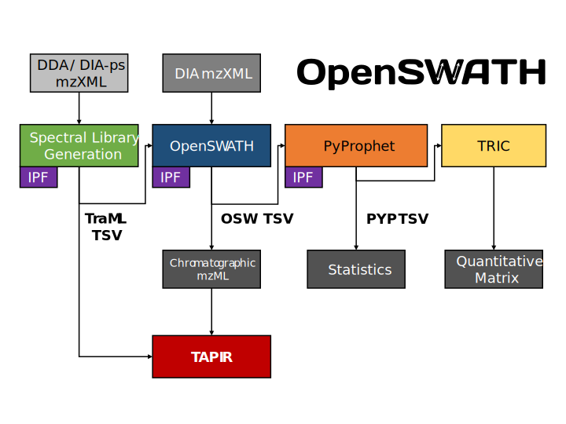

Introduction
====================================
The OpenSWATH Workflow enables targeted data analysis of data-independent
acquisition (DIA) or SWATH-MS proteomic data. The main workflow consists of
OpenSWATH, PyProphet, TRIC, IPF and TAPIR. This website provides documentation
on installation and application of the tools.

News
----

.. note::

   *2018-11-07:* The Docker image now includes OpenMS 2.4.0 and PyProphet 2.0.1.

.. note::

   *2018-11-07:* With the release of OpenMS 2.4.0 and PyProphet 2.0.1, the new
   OpenSWATH workflow is available in the release branches.

.. note::

   *2018-03-22:* We provide an *experimental* Docker image for the latest development version of the OpenSWATH workflow.

.. note::

   *2017-12-28:* The tools of the OpenSWATH Workflow now provide *experimental* support for new SQLite-based file formats.

The OpenSWATH Workflow
----------------------

.. toctree::
   :maxdepth: 3
   :caption: Installation
   
   docs/docker
   docs/binaries
   docs/sources

.. toctree::
   :maxdepth: 3
   :caption: Getting Started

   docs/getting_started

.. toctree::
   :maxdepth: 3
   :caption: Spectral library generation
   
   docs/generic
   docs/tpp
   docs/skyline
   docs/swathatlas
   docs/pqp

.. toctree::
   :maxdepth: 3
   :caption: Targeted data extraction
   
   docs/openswath
   
.. toctree::
   :maxdepth: 3
   :caption: Statistical validation
   
   docs/pyprophet
   docs/percolator
   
.. toctree::
   :maxdepth: 3
   :caption: Multi-run alignment
   
   docs/tric

.. toctree::
   :maxdepth: 3
   :caption: PTMs / Peptidoforms
   
   docs/ipf
   
.. toctree::
   :maxdepth: 3
   :caption: Chromatogram visualization
   
   docs/tapir

.. toctree::
   :maxdepth: 3
   :caption: Mobi-DIK 
   
   docs/mobi-dik
   docs/dataconversion
   docs/librarygeneration
   docs/openswath_mobidik

.. toctree::
   :maxdepth: 3
   :caption: Differential expression analysis
   
   docs/swath2stats
   
Acknowledgments
---------------
The tools and workflows are being developed at the `Aebersold Group at IMSB, ETH Zurich <http://www.imsb.ethz.ch/research/aebersold.html>`_, `University of Toronto <http://roestlab.org/>`_ and `Columbia University <https://systemsbiology.columbia.edu/>`_ with contributions from others. The core components are implemented as part of the `OpenMS <http://www.openms.org>`_ framework, the `PyProphet <https://github.com/PyProphet>`_, and `msproteomicstools <https://github.com/msproteomicstools>`_ distributions.
