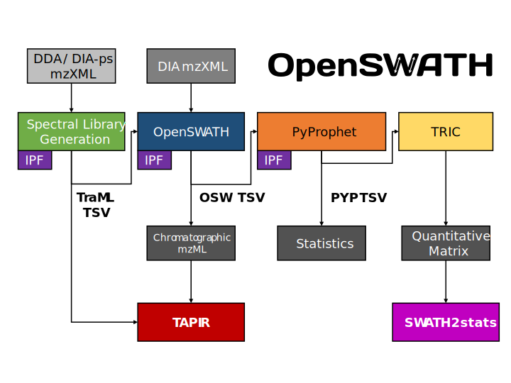

Introduction
====================================
The OpenSWATH Workflow enables targeted data analysis of data-independent acquisition (DIA) or SWATH-MS proteomic data. The main workflow consists of OpenSWATH, PyProphet, TRIC, IPF and TAPIR. This website provides documentation on installation and application of the tools.

Acknowledgments
---------------
The tools and workflows are being developed at the `Aebersold Group at IMSB, ETH Zurich
<http://www.imsb.ethz.ch/research/aebersold.html>`_ and `Stanford University
<http://www.stanford.edu>`_ with contributions from others. The core components are implemented as part of the `OpenMS
<http://www.openms.org>`_ framework, the `PyProphet
<https://github.com/PyProphet>`_, and `msproteomicstools
<https://github.com/msproteomicstools>`_ distributions.

.. toctree::
   :maxdepth: 3
   :caption: Spectral library generation
   
   docs/generic
   docs/tpp
   docs/skyline
   docs/swathatlas
   docs/pqp

.. toctree::
   :maxdepth: 3
   :caption: Targeted data extraction
   
   docs/openswath
   docs/openswath_workflow
   
.. toctree::
   :maxdepth: 3
   :caption: Statistical validation
   
   docs/pyprophet
   docs/percolator
   
.. toctree::
   :maxdepth: 3
   :caption: Multi-run alignment
   
   docs/tric

.. toctree::
   :maxdepth: 3
   :caption: PTMs / Peptidoforms
   
   docs/ipf
   
.. toctree::
   :maxdepth: 3
   :caption: Chromatogram visualization
   
   docs/tapir

.. toctree::
   :maxdepth: 3
   :caption: Differential expression analysis
   
   docs/swath2stats
   
